# Curio — AI Fashion Shopping Agent

An AI-powered personal shopping assistant that helps users discover fashion through natural conversation and visual search. Describe your vibe, upload a photo, and the AI finds the right products — learning your taste as you talk.

---

## Demo

[Watch the demo (Google Drive)](https://drive.google.com/file/d/1QyGGAnONiTyw-UYIpHnHRgtJyfJ1cTRF/view?usp=sharing)

---

## Screenshots

### Home
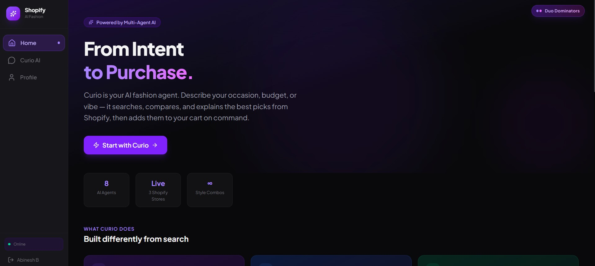
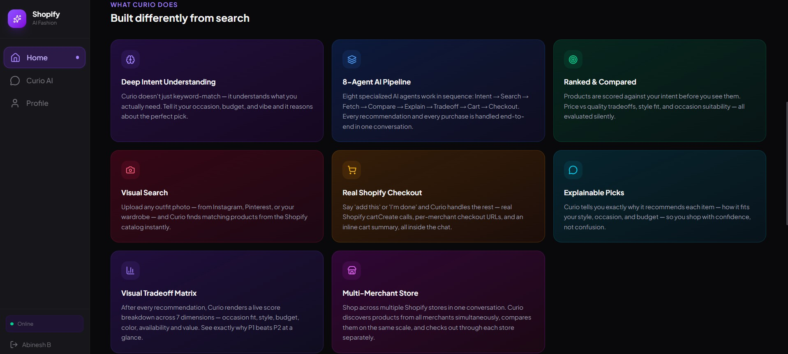

### Skincare Routine Builder — Multi-Merchant Store
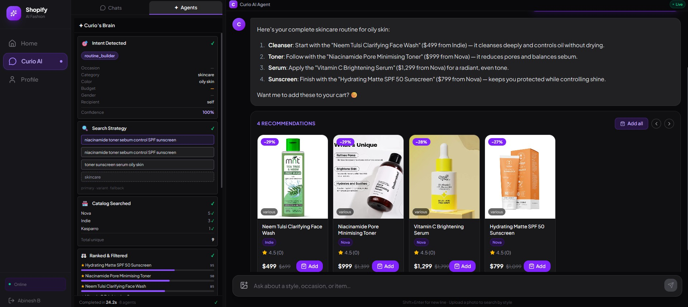

### Real Shopify Integration — Cart and Checkout
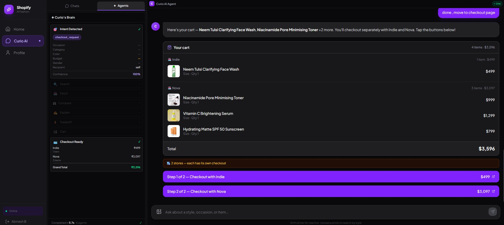
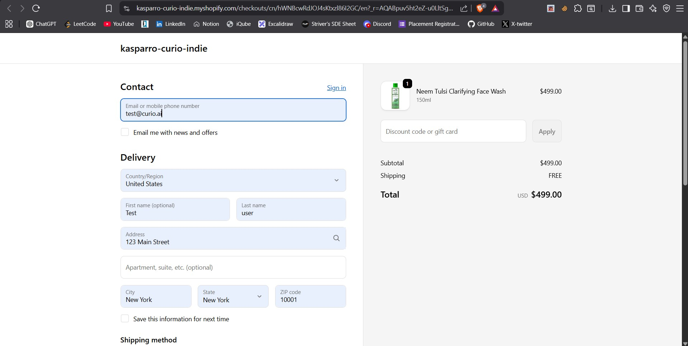
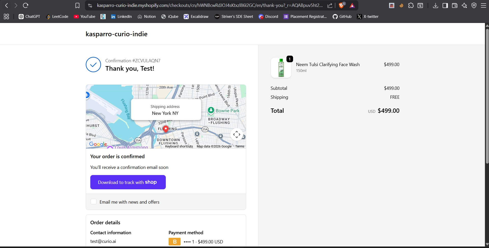
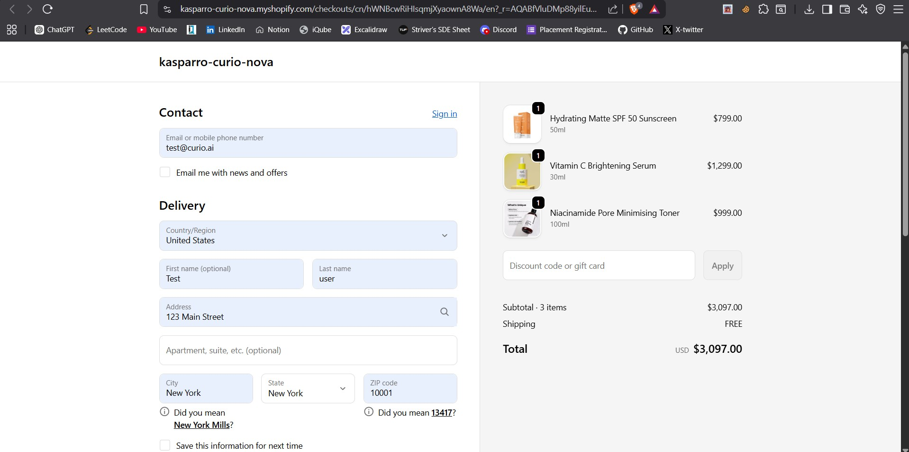
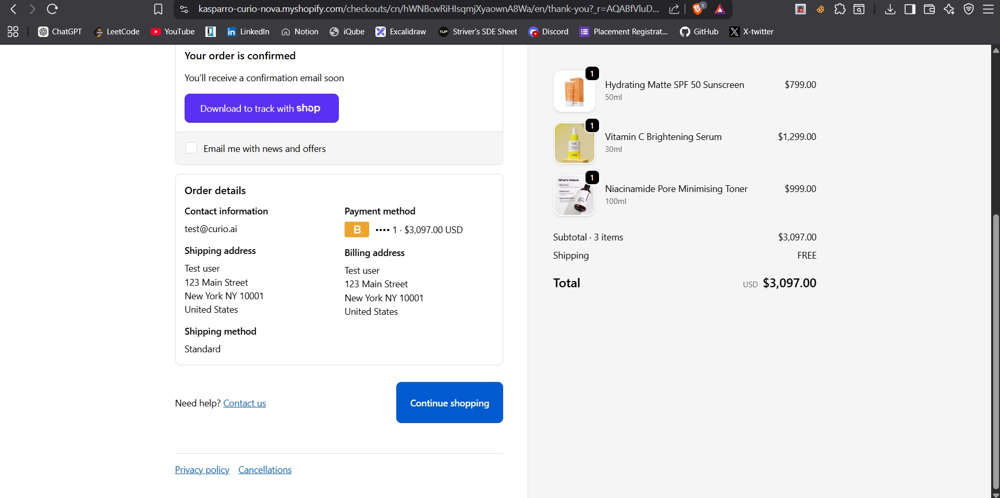
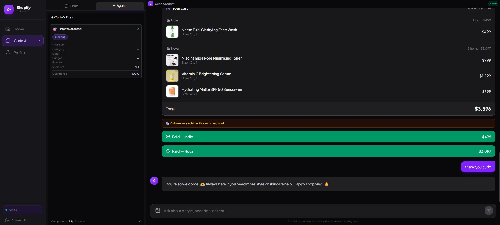

### Conversational Chat — Live Agent Reasoning Panel
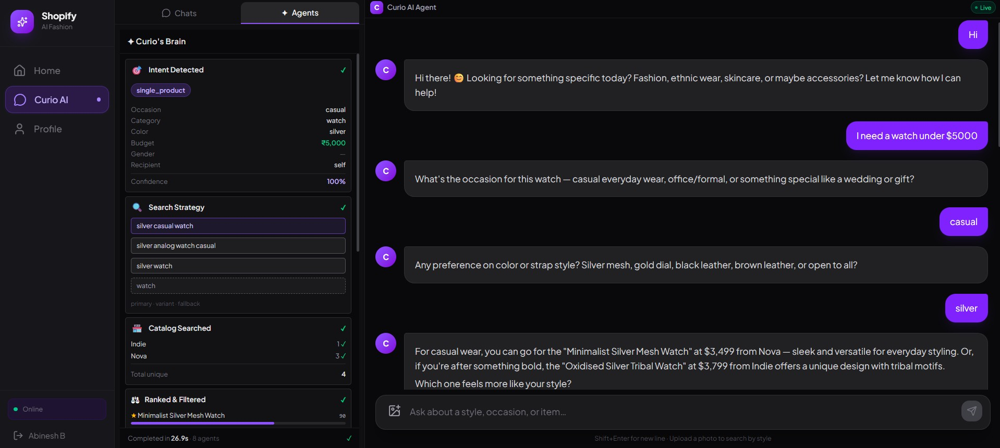

### Visual Tradeoff Matrix
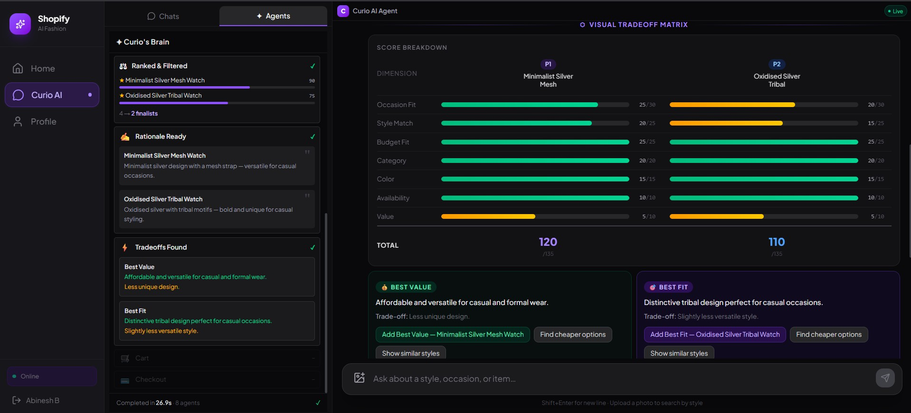
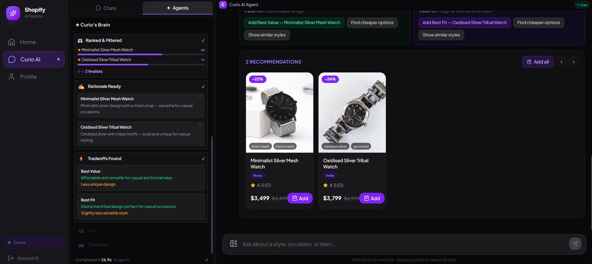

### Visual Search
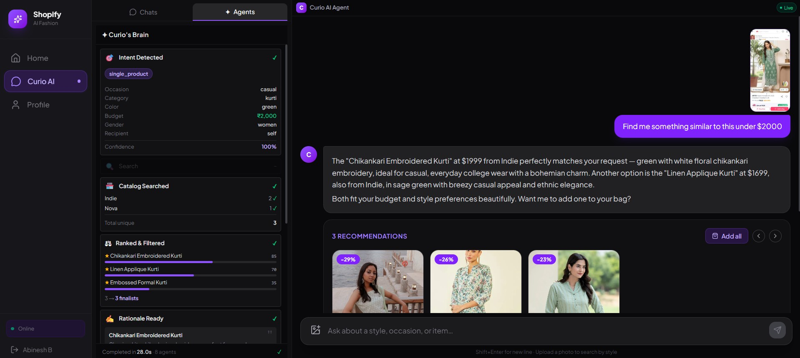
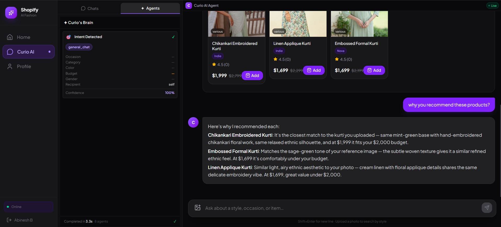

---

## What We Built

A full-stack AI shopping platform with:

- **Curio AI Chat** — Conversational shopping assistant powered by a 7-agent pipeline (Azure OpenAI GPT-4o). Ask in plain language, get curated product recommendations with stylist-quality reasoning.
- **Live Agent Reasoning Panel** — A real-time sidebar panel that visualises all 8 AI agents as they execute. Every step animates in — intent extraction, search queries, store fetch, product scoring, styling rationale, tradeoff analysis, cart, and checkout — so the user sees exactly what Curio is doing instead of waiting on a spinner.
- **Visual Tradeoff Matrix** — After every recommendation, an animated score breakdown renders in chat — 7 dimensions, Best Fit vs Best Value panels, contextual quick-reply buttons.
- **Multi-Merchant Store** — Products from multiple Shopify stores (Nova + Indie) are fetched in parallel, compared on the same scale, and checked out separately per merchant.
- **Visual Search** — Upload any outfit photo and the AI (Ollama vision) extracts style attributes and finds similar products from the live Shopify catalog.
- **Live Style Profile** — Preferences (style, colors, budget, occasions, size) are learned automatically from the conversation and displayed in real-time.
- **Cart Management** — Add products directly from the conversation using natural language ("add the first one in M", "add both").
- **Conversational Checkout** — Say "I'm done" or "checkout" and Curio shows an inline cart summary with real Shopify checkout URLs generated via `cartCreate`.
- **User Auth** — Simple login with session-scoped cart and preferences.
- **Indian Market Context** — Native ₹ budgets, Indian occasions, Indian fashion categories, and Hinglish understanding.

---

## How It Works

1. **Chat** — Tell Curio what you're looking for in plain language
2. **Agent pipeline** — Intent → Search → Fetch → Compare → Explain → Respond → Tradeoff — each step streams to the Live Agent Reasoning Panel in real time
3. **Get recommendations** — Products appear inline in the conversation, matched and ranked by occasion fit, style, and budget
4. **Upload a photo** — Visual AI extracts the style and finds similar items
5. **Watch your style profile build** — Preferences update in real-time as you chat
6. **Add to cart** — By name, ordinal ("the second one"), or confirmation ("yes please")
7. **Checkout from the chat** — "I'm done" → inline cart summary → one-tap checkout per merchant

---

## Getting Started

### Prerequisites

- [Docker + Docker Compose](https://docs.docker.com/get-docker/) — for the containerised setup
- [Python 3.11+](https://www.python.org/) — for local backend
- [Node.js 20+](https://nodejs.org/) — for local frontend
- [Ollama](https://ollama.com/) — running locally or on a network machine with `llama3.2-vision` pulled
- Azure OpenAI resource with a `gpt-4o` deployment
- Shopify Storefront API token

---

### Option 1 — Docker (recommended)

**1. Clone the repo**
```bash
git clone https://github.com/your-org/kasparro.git
cd kasparro
```

**2. Configure environment**
```bash
cp backend/.env.example backend/.env
```

Open `backend/.env` and fill in:
```env
AZURE_OPENAI_API_KEY=your_key
AZURE_OPENAI_ENDPOINT=https://your-resource.cognitiveservices.azure.com/
AZURE_OPENAI_MODEL=gpt-4o
OLLAMA_BASE_URL=http://host.docker.internal:11434
SHOPIFY_STORE_URL=your-store.myshopify.com
SHOPIFY_ACCESS_TOKEN=shpat_your_admin_token
SHOPIFY_STOREFRONT_TOKEN=your_storefront_token
```

**3. Start Ollama on your host machine**

Ollama runs on the host (not inside Docker). The backend container reaches it via `host.docker.internal:11434`.

```bash
ollama pull llama3.2-vision
ollama serve
```

> On Linux, `host.docker.internal` may not resolve automatically. If so, set `OLLAMA_BASE_URL=http://172.17.0.1:11434` in `backend/.env` (your Docker bridge IP).

**4. Start all services**
```bash
docker-compose up --build
```

| Service | URL |
|---|---|
| Frontend | http://localhost:3000 |
| Backend API | http://localhost:8000 |
| API Docs | http://localhost:8000/docs |

---

### Option 2 — Local (without Docker)

**1. Backend**
```bash
cd backend
pip install -r requirements.txt
cp .env.example .env      # then fill in credentials
python run.py
# → running on http://localhost:8000
```

**2. Frontend**
```bash
cd frontend
npm install
npm run dev
# → running on http://localhost:3000
```

**3. Ollama (vision model)**
```bash
ollama pull llama3.2-vision
ollama serve
```

---

## Tech Stack

| Layer | Technology |
|---|---|
| Frontend | Next.js 16, React 19, TypeScript, Tailwind CSS v4 |
| UI Components | Radix UI, Lucide icons, Framer Motion |
| Backend | FastAPI, Uvicorn, Pydantic v2 |
| Chat / Agents LLM | Azure OpenAI — `gpt-4o` |
| Vision LLM | Ollama — `llama3.2-vision:latest` |
| Product Data | Shopify Admin GraphQL API |
| Cart & Checkout | Shopify Storefront API |
| Streaming | Server-Sent Events (SSE) |
| Session State | In-memory |

---

## Project Structure

```
kasparro/
├── backend/
│   ├── app/
│   │   ├── api/v1/          # chat, visual-search, products, preferences, cart, auth, health
│   │   ├── services/        # orchestrator, llm, azure, ollama, shopify, cart, product, preference
│   │   ├── schemas/         # Pydantic models — chat, product, preference
│   │   └── core/
│   │       ├── config.py
│   │       ├── middleware.py
│   │       └── prompts/     # 8 agent prompts — intent, search, compare, explain, tradeoff, cart, checkout, orchestrator
│   ├── db/users.json        # File-based user store
│   ├── requirements.txt
│   ├── run.py
│   └── .env.example
├── frontend/
│   ├── app/                 # Pages — home, login, curio, cart, profile
│   ├── components/
│   │   ├── chat/            # ChatInterface, AgentPanel, MessageBubble, TradeoffMatrix, ChatInput
│   │   ├── layout/          # Sidebar, ClientLayout
│   │   ├── products/        # ProductCard, InlineProducts
│   │   ├── preferences/     # PreferencePanel — live style profile
│   │   └── visual-search/   # AttributeTags — extracted image attributes
│   ├── hooks/               # use-chat (state machine), use-cart
│   ├── services/            # api.ts — fetch wrappers + SSE async generator
│   ├── types/               # index.ts — all TypeScript interfaces
│   ├── lib/utils.ts
│   ├── public/              # Static assets — icons, images
│   └── Dockerfile
├── resources/
│   ├── kasparro-curio-nova-products/    # Nova merchant — product images + catalog CSV
│   ├── kasparro-curio-indie-products/   # Indie merchant — product images + catalog CSV
│   ├── kasparro-dev-products/           # Dev/test catalog — product images + CSV
│   └── templates/product_template.csv  # CSV template for adding new merchant products
├── docs/
│   ├── product.md           # Features and value proposition
│   ├── technical.md         # Architecture, API reference, data models
│   └── DECISIONS.md         # Key architectural and product decisions
├── docker-compose.yml
└── README.md
```

---

## Environment Variables

**`backend/.env`**

| Variable | Required | Description |
|---|---|---|
| `AZURE_OPENAI_API_KEY` | Yes | Azure OpenAI API key |
| `AZURE_OPENAI_ENDPOINT` | Yes | Azure OpenAI endpoint URL |
| `AZURE_OPENAI_API_VERSION` | Yes | API version (e.g. `2024-12-01-preview`) |
| `AZURE_OPENAI_MODEL` | Yes | Deployment name (e.g. `gpt-4o`) |
| `OLLAMA_BASE_URL` | Yes | Ollama server URL |
| `OLLAMA_VISION_MODEL` | Yes | Vision model name (e.g. `llama3.2-vision:latest`) |
| `SHOPIFY_STORE_URL` | Yes | Shopify store URL (e.g. `your-store.myshopify.com`) |
| `SHOPIFY_ACCESS_TOKEN` | Yes | Shopify Admin API token (product fetch) |
| `SHOPIFY_STOREFRONT_TOKEN` | Yes | Shopify Storefront API token (cartCreate / checkout) |


---

## Team & Contributions

**Duo Dominators**

**Abinesh B** — led product thinking and full-stack engineering. Designed the multi-agent pipeline architecture, built the FastAPI backend (orchestrator, all 8 agent prompts, Shopify integration, SSE streaming, cart and checkout logic), defined the SSE event contract between backend and frontend, and implemented the Live Agent Reasoning Panel state machine on the frontend.

**Ambika S** — led frontend and UI. Built the chat interface, product cards, tradeoff matrix component, style profile panel, visual search flow, and the overall visual design across all pages. Also owned all project documentation — product overview, technical reference, architectural decision log, and this README.

Both contributed jointly to the product scope, demo flow, and testing against the live Shopify catalog.
